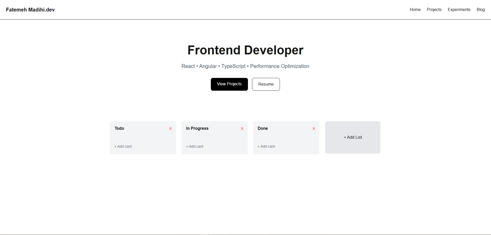

# DevFlow


A modern Kanban board for developers built with **Next.js, TypeScript, Zustand, and dnd-kit**.

## Live Demo
https://devflow-board.vercel.app/

## Preview



## Features
- Drag & drop task management with **dnd-kit**
- Column-based **Kanban workflow**
- Fast global state management with **Zustand**
- Responsive UI
- Built with **Next.js App Router**

## Tech Stack
- **Next.js**
- **React**
- **TypeScript**
- **Zustand**
- **dnd-kit**
- **Tailwind CSS**

## Getting Started

Clone the repository:

```bash
git clone https://github.com/fmadihi/project.git
cd project
```

Install dependencies:

```bash
npm install
```

Run the development server:

```bash
npm run dev
```

Open http://localhost:3000 in your browser.

## Project Structure

```
app/            # Next.js App Router pages
components/     # Reusable UI components
store/          # Zustand state management
types/          # TypeScript types
```

## Future Improvements
- Persist tasks using **localStorage or database**
- **User authentication**
- Task **due dates and labels**
- Multiple boards support

## Author
GitHub: https://github.com/fmadihi
